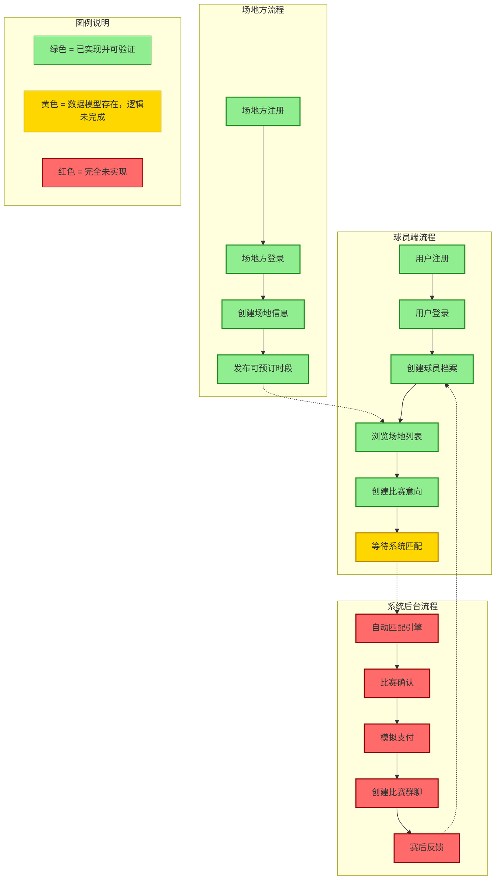

# 篮球匹配平台 — 可视化业务流程与能力边界说明

> **面向受众**：产品经理、业务方、潜在投资人（非技术人员）
> **当前状态**：后端核心 Service 层已完成 4 个模块，303 个单元测试全部通过
> **文档目的**：直观展示"目前已完成的部分"能支持什么业务流程，以及"哪些功能还无法演示"

---

## 一、端到端业务流程图

下图展示了从"用户注册"到"赛后反馈"的完整业务闭环。每个节点用颜色标识了当前实现状态：

- **绿色** = 已实现并可验证（Service 层 + 单元测试完整）
- **黄色** = 数据模型已存在，但业务逻辑未完成
- **红色** = 完全未实现



---

## 二、验证点清单（针对绿色节点）

针对流程图中每个 **绿色（已实现）** 节点，以下是给非技术人员设计的验证问题与预期答案：

### A. 用户注册

| 编号 | 验证问题 | 预期答案/展示效果 |
|------|---------|------------------|
| A-1 | 同一个手机号能否重复注册？ | **不能**。系统会提示"该手机号已被注册"。数据库层面也有唯一约束作为兜底。 |
| A-2 | 注册时输入的密码，数据库里能看到明文吗？ | **不能**。密码经过 bcrypt 加密（成本因子 12），连数据库管理员也看不到原始密码。 |
| A-3 | 注册时填写的真实姓名和身份证号，数据库里安全吗？ | **安全**。这些敏感字段使用 AES-GCM 加密存储，只有授权的系统才能解密。 |

### B. 用户登录

| 编号 | 验证问题 | 预期答案/展示效果 |
|------|---------|------------------|
| B-1 | 登录成功后，系统会给用户什么凭证？ | 返回 **Access Token**（2 小时有效）+ **Refresh Token**（7 天有效），后续访问凭此 Token 证明身份。 |
| B-2 | 如果密码输错了，系统会提示"密码错误"还是"用户名不存在"？ | **统一提示"手机号或密码错误"**，防止恶意用户通过错误提示枚举有效手机号。 |
| B-3 | 用户的 Refresh Token 被盗了怎么办？ | 每次刷新 Token 时，旧 Token 会被 **原子性删除**（Redis GETDEL），盗取的 Token 只能使用一次。 |

### C. 创建球员档案

| 编号 | 验证问题 | 预期答案/展示效果 |
|------|---------|------------------|
| C-1 | 球员输入身高、体重、球龄后，系统会自动算出能力值吗？ | **会**。系统基于全国篮球人口百分位数据，加权计算基础能力值（0-100 分）。 |
| C-2 | 如果我更新了身高，能力值会自动重新计算吗？ | **会**。系统智能检测哪些字段影响能力值，仅在这些字段变化时才重算，避免不必要的计算。 |
| C-3 | 一个球员可以选几个司职位置？ | **最多 3 个**，按优先级排序（如：第一选择 SG 得分后卫，第二选择 SF 小前锋）。 |

### D. 浏览场地

| 编号 | 验证问题 | 预期答案/展示效果 |
|------|---------|------------------|
| D-1 | 场地列表默认显示什么状态的场地？ | **只显示"营业中"的场地**，已停业或暂停营业的自动过滤，避免用户看到无效信息。 |
| D-2 | 场地方删除账号后，他发布的场地和时段还在吗？ | **不会**。场地方删除后，场地和时段会 **自动级联清理**，不会产生"孤儿数据"。 |
| D-3 | 场地方可以修改别人的场地信息吗？ | **不能**。系统严格校验场地归属权，非所有者操作会提示"无权操作该场地"。 |

### E. 创建比赛意向

| 编号 | 验证问题 | 预期答案/展示效果 |
|------|---------|------------------|
| E-1 | 同一个球员能否在同一时间段提交两个意向？ | **不能**。系统会自动检测时间重叠并拒绝，防止一个人占多个坑。 |
| E-2 | 意向提交后，系统怎么知道这场比赛在哪个地区打？ | **自动推断**：优先读取球员档案里的地区，如果没有则使用首选场地的地区编码。 |
| E-3 | 比赛时间有什么限制？ | 必须 **至少提前 1 小时** 提交；比赛时长必须在 **120-360 分钟** 之间。 |
| E-4 | 可以选择几个场地和赛制？ | 场地和赛制各 **1-3 个**，按优先级排序，给匹配引擎提供灵活选择空间。 |

### F. 等待系统匹配（黄色节点 — 数据模型已存在）

| 编号 | 验证问题 | 预期答案/展示效果 |
|------|---------|------------------|
| F-1 | 意向提交后的状态是什么？能持续多久？ | 状态为 **"等待匹配"（pending）**，默认 30 分钟后自动过期（可配置）。 |
| F-2 | 意向在匹配前可以修改或取消吗？ | **可以**。只要还在"等待匹配"状态，球员可以随时修改时间、场地、赛制偏好，或取消意向。 |
| F-3 | 匹配成功后意向状态会变吗？ | **会变**。数据模型已定义 matched / confirmed / cancelled / expired / failed 等状态，但 **触发状态变化的匹配引擎尚未开发**。 |

---

## 三、演示方案概述

### 如何运行演示

我们提供了一个端到端的演示脚本，串联所有已完成的模块功能。运行方式：

```bash
# 1. 确保 Docker 环境已启动（PostgreSQL + Redis）
cd d:\AI_coding_projects\AIcoding_IBA
docker-compose -f docker-compose.dev.yml up -d

# 2. 确保数据库迁移已执行（包含 Format 种子数据）
cd server
npm run migration:run

# 3. 运行完整演示
npm run demo:full
```

### 演示脚本执行流程

脚本会按顺序执行以下 8 个步骤，每个步骤都有中文说明和结果输出：

```
步骤 1: 场地方注册
  └── 调用 AuthService.register() → 创建场地方用户 + VenueManager 记录

步骤 2: 创建场地并发布时段
  ├── 调用 AuthService.login() → 场地方登录
  ├── 调用 VenueService.create() → 创建"星光篮球馆"
  └── 调用 VenueService.createTimeSlots() → 发布 3 个可预订时段

步骤 3: 球员注册
  └── 调用 AuthService.register() → 创建球员用户（含 Player 记录）

步骤 4: 球员登录
  └── 调用 AuthService.login() → 获取 Access Token + Refresh Token

步骤 5: 球员档案 — 能力值自动计算
  ├── 调用 PlayerService.findByUserId() → 查看当前能力值
  └── 调用 PlayerService.update() → 更新身高，观察能力值自动重算

步骤 6: 创建比赛意向
  ├── 查询数据库中的可用赛制（Format 种子数据）
  └── 调用 IntentionService.create() → 提交"想打球"意向

步骤 7: 查询意向详情
  └── 调用 IntentionService.findById() → 查看意向完整信息（含场地/赛制偏好）

步骤 8: 边界场景演示
  ├── 重复注册拦截 → 验证 AuthService.register() 的冲突检测
  ├── 时间重叠拦截 → 验证 IntentionService.create() 的重叠检测
  └── 时段重叠拦截 → 验证 VenueService.createTimeSlots() 的重叠检测
```

### 输出示例

```
═══════════════════════════════════════════════════════════════
  步骤 1: 场地方注册
═══════════════════════════════════════════════════════════════
  注册成功 | 用户ID: 42
  脱敏手机号 | 137****7000
  Token状态 | AccessToken已生成，RefreshToken已存入Redis

═══════════════════════════════════════════════════════════════
  步骤 2: 创建场地并发布时段
═══════════════════════════════════════════════════════════════
  场地创建成功 | 场地ID: 15, 名称: 星光篮球馆
  场地价格 | ¥280/小时
  设施配置 | 木地板 | LED灯光 | 室内 | 空调 | 停车位
  时段创建成功 | 共 3 个时段
  时段 | 2026-06-05 09:00-11:00 | 已预订: 否
  时段 | 2026-06-05 14:00-16:00 | 已预订: 否
  时段 | 2026-06-05 19:00-21:00 | 已预订: 否

...（后续步骤类似格式）
```

---

## 四、能力边界声明

### 当前可以演示的内容

| 类别 | 具体能力 | 对应模块 |
|------|---------|---------|
| **账号安全** | 用户注册/登录/刷新 Token/注销；bcrypt 密码加密；手机号脱敏显示；JWT Token 签发与验证；Redis 刷新令牌存储与单次使用轮换 | AuthService |
| **球员管理** | 创建球员档案；自动计算篮球能力值（基于身高/体重/年龄/臂展等百分位数据）；更新档案时智能重算能力值；司职位置管理（最多 3 个） | PlayerService |
| **场地管理** | 场地方注册；场地 CRUD（含完整设施信息）；可预订时段创建/查询；时段重叠检测；级联删除（删除场地自动清理时段） | VenueService |
| **意向管理** | 提交比赛意向（含场地/赛制偏好）；意向修改（仅 pending 状态）；意向取消；时间重叠检测；自动计算结束时间和过期时间；regionCode 自动解析 | IntentionService |
| **数据完整性** | 所有写操作使用数据库事务保证原子性；外键关联与级联删除；字段级校验（class-validator）；乐观锁防并发冲突 | 全局 |

### 当前绝对不能演示的内容

| 类别 | 缺失内容 | 说明 | 计划模块 |
|------|---------|------|---------|
| **匹配引擎** | 无法将多个球员的意向自动匹配成一场比赛 | 匹配算法、蛇形分队、动态阈值均未开发 | Module 2.6 |
| **比赛确认** | 意向匹配后无法确认参赛 | 确认流程、人数检查、自动预订场地均未开发 | Module 2.7 |
| **模拟支付** | 无法演示保证金支付流程 | 支付抽象接口、模拟支付实现、超时关闭均未开发 | Module 2.7 |
| **赛后反馈** | 比赛结束后无法评分写评价 | 反馈表单、调节值计算、能力值修正均未开发 | Module 2.8 |
| **通知服务** | 无法发送任何通知 | 推送/短信/站内信渠道均未开发 | Module 2.9 |
| **实时通信** | 球员之间无法实时聊天 | 群聊消息服务、WebSocket 网关均未开发 | Module 2.10 & 4.1 |
| **REST API** | 没有 HTTP 接口供外部调用 | 所有 Controller 层均未开发 | Phase 3 |
| **前端界面** | 没有可视化的用户界面 | 移动端 App、管理后台均未开发 | Phase 5 |
| **部署环境** | 没有线上可访问的演示环境 | Docker 生产部署、CI/CD 均未配置 | Phase 6 & 7 |

---

## 五、项目整体进度一览

| 阶段 | 模块数 | 已完成 | 完成率 | 状态 |
|------|--------|--------|--------|------|
| Phase 0：基础设施 | 6 | 6 | 100% | 完成 |
| Phase 1：数据层与核心实体 | 6 | 6 | 100% | 完成 |
| Phase 2：核心逻辑模块 | 10 | 5 | 50% | 进行中 |
| Phase 3：接口层（RESTful API） | 9 | 0 | 0% | 未开始 |
| Phase 4：WebSocket 实时层 | 1 | 0 | 0% | 未开始 |
| Phase 5：前端开发 | 7 | 0 | 0% | 未开始 |
| Phase 6：部署与运维 | 2 | 0 | 0% | 未开始 |
| Phase 7：可观测性 | 2 | 0 | 0% | 未开始 |
| **合计** | **43** | **17** | **39.5%** | |

> **测试统计**：303 个单元测试全部通过，核心模块代码覆盖率 95%+。
